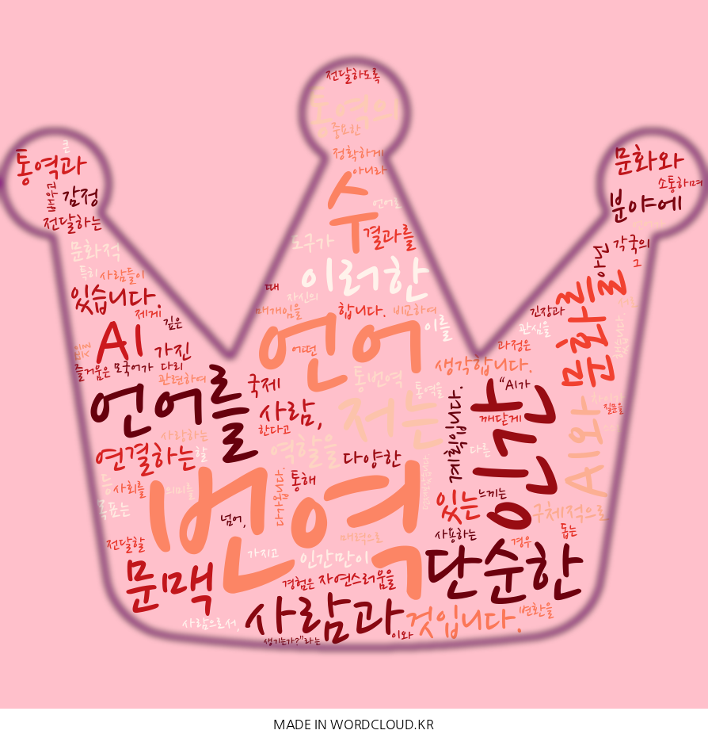

# 자기소개

## About Me

&nbsp;&nbsp;&nbsp;&nbsp;
저는 언어를 사랑하는 사람으로서, 통역과 번역 분야에 깊은 관심을 가지고 있습니다. 서로 다른 언어를 사용하는 사람들이 자신의 뜻을 정확하게 전달하도록 돕는 과정은 단순한 언어 변환을 넘어, 사람과 사람, 문화와 문화를 연결하는 다리 역할을 한다고 생각합니다. 특히 모국어가 아닌 언어를 배우고 그 언어로 소통하며 의미를 전달할 때 느끼는 긴장과 즐거움은 제게 큰 매력으로 다가옵니다. 이러한 경험은 언어가 단순한 도구가 아니라 사람과 사회를 연결하는 중요한 매개임을 깨닫게 했습니다. 

&nbsp;&nbsp;&nbsp;&nbsp;
이와 관련하여 저는 “AI가 통역을 할 경우 인간 통역과 비교하여 어떤 차이가 생기는가?”라는 질문을 스스로 던져보았습니다. 기술의 발전 덕분에 AI는 번역 속도와 정확도 면에서 인간을 능가할 수 있지만, 감정 표현과 문화적 뉘앙스, 문맥 이해 등 인간만이 가진 섬세한 요소는 재현하기 어렵다고 생각합니다. 이를 구체적으로 검증하기 위해, 저는 다양한 통번역 자료를 수집하여 AI 번역과 인간 통역 결과를 비교 분석할 계획입니다. 예를 들어, 국제 회의 기록록, 뉴스 기사, 인터뷰 자료 등 실제 통번역 사례를 대상으로 하여 AI와 인간 통역의 문맥 정확성, 의미 전달력, 감정 표현의 자연스러움을 평가하는 체계적인 실험을 진행할 것입니다. 이러한 실험은 AI 번역이 가진 장점과 한계를 명확히 이해하고, 인간 통역사가 더 창의적이고 세밀한 번역에 집중할 수 있는 기반을 마련해 줄 것입니다.

&nbsp;&nbsp;&nbsp;&nbsp;
또한, AI를 단순한 번역 도구가 아닌 보조자 로 활용할 계획입니다. AI가 생성한 번역 결과를 검토하며 맞춤법, 문맥 흐름, 어색한 표현 등을 점검하고, 필요에 따라 수정함으로써 최종 번역의 정확성과 자연스러움을 높일 수 있습니다. 이 과정에서 반복적인 작업과 시간 소모를 줄이고, 인간 통역사로서 창의적 판단과 문화적 감각을 발휘할 수 있는 여유를 확보하게 됩니다. 이를 통해 AI와 인간 통역의 장점을 결합한 효율적이고 정밀한 번역 체계를 구축하고자 합니다.

&nbsp;&nbsp;&nbsp;&nbsp;
저의 궁극적인 목표는 5년 뒤 UN에서 국제통역사로 활동하며 세계 각국의 사람들과 만나 다양한 문화를 경험하는 것입니다. AI 기술을 적절히 활용하면서도 인간만이 살릴 수 있는 감정과 뉘앙스를 전달하는 전문 통역사로 성장하고 싶습니다. 언어를 매개로 사람과 사람, 문화와 문화를 연결하며 각국의 이야기를 정확히 전달하는 역할을 수행하고, AI와 인간 통역의 조화를 통해 더욱 풍부하고 정확한 국제 소통을 가능하게 하고자 합니다. 이러한 목표는 제 전공 분야에 대한 관심과 연구 계획, 그리고 현실적 적용 방안을 자연스럽게 연결하며, 미래 통역사로서의 전문성과 비전을 구체적으로 보여줍니다.

